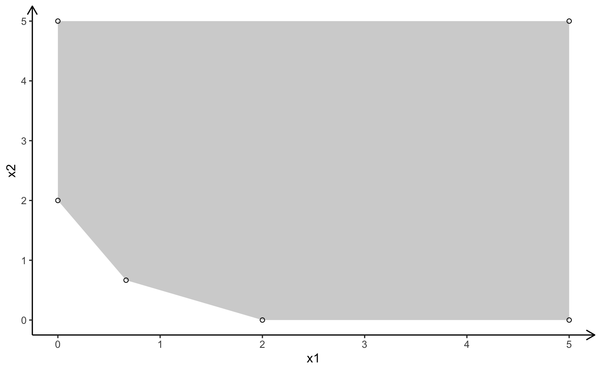

```{r message = FALSE, warning = FALSE, include = FALSE}

library(simplexR)

```

```{r, message = FALSE, warning = FALSE, include = FALSE, echo = FALSE}

source("_gMOIP_functions.R")

```

## Primal and Dual Problem (Primal Simplex Algorithm)

### Primal Problem
$$
\begin{array}{rrcrcr}
\max  & 2x_1 & + & 2x_2 & \\
s.t.  & 2x_1 & + & 1x_2 & \leq & 4 \\
      & 1x_1 & + & 2x_2 & \leq & 5 \\
      &  x_1,&  &  x_2 & \geq & 0
\end{array}
$$

```{r}

# Quanti

# primal problem
# optimal solution x = (1, 2), z = 6

A <- matrix(c(
  2, 1,
  1, 2
), nrow = 2, ncol = 2, byrow = TRUE, dimnames = list(c("R1", "R2"), c("x1", "x2")))

b <- c(4, 5)
c <- c(2, 2)

plot_linear_program(A = A, b = b, obj = c, crit = "max", plotOptimum = TRUE, labels = "coord")

```


```{r}

simplexR(A, b, c)

```

### Dual Problem

$$
\begin{array}{rrcrcr}
\min  & 4y_1 & + & 5y_2 & \\
s.t.  & 2y_1 & + & 1y_2 & \geq & 2 \\
      & 1y_1 & + & 2y_2 & \geq & 2 \\
      &  y_1,&   &  y_2 & \geq & 0
\end{array}
$$

```{r}

# dual problem
# optimal solution y = (2/3, 2/3), z = 6

A <- matrix(c(
  2, 1,
  1, 2
), nrow = 2, ncol = 2, byrow = TRUE, dimnames = list(c("R1", "R2"), c("y1", "y2")))

c <- c(4, 5)
b <- c(2, 2)
sense <- -1
relation <- c(">=", ">=")

```



```{r}

simplexR(A, b, c, sense, relation)

```

## Dual Problem (Dual Simplex Algorithm)

The dual problem can be formulated (by multiplying the constraints with $(-1)$) in the following form:

$$
\begin{array}{rrcrcr}
\min  &  4y_1 & + & 5y_2 & \\
s.t.  & -2y_1 & - & 1y_2 & \leq & -2 \\
      & -1y_1 & - & 2y_2 & \leq & -2 \\
      &  y_1,&   &  y_2 & \geq & 0
\end{array}
$$

It is strait forward to construct a simplex tableau that is dual feasible (primal optimal) but not primal feasible (not dual optimal):

```{r}

dual_feasible_tableau <- rbind(cbind(-A, diag(nrow(A)), -b), c(c, rep(0, nrow(A)), 0))
#dual_feasible_tableau <- rbind(cbind(A, diag(nrow(A)), -b), c(c, rep(0, nrow(A)), 0))
dual_feasible_tableau

```


Now the dual simplex can be applied

```{r}

dual_simplex(dual_feasible_tableau)

```
